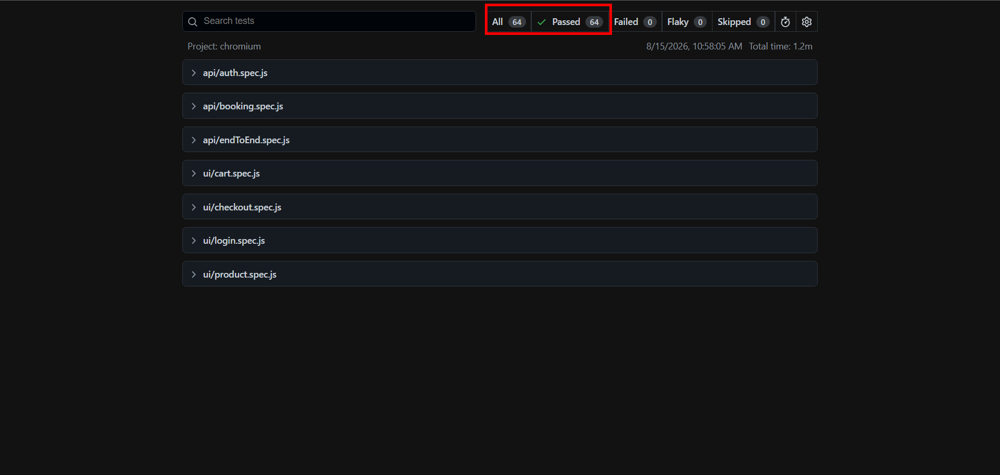

# Playwright E-Commerce Automation Framework

UI and API automation framework built with Playwright and JavaScript.

The project combines front-end testing using SauceDemo and API testing using Restful-Booker within a single automation framework.

## What It Tests

### UI Automation

#### Login

- Valid login
- Invalid login
- Locked user validation
- Empty username validation
- Empty password validation

#### Products

- Product listing verification
- Product detail verification
- Product image verification
- Inventory validation
- Product sorting

#### Cart

- Add single product
- Add multiple products
- Remove products
- Verify cart badge count
- Continue shopping flow

#### Checkout

- Empty field validations
- Checkout cancellation
- End-to-end order completion

### API Automation

#### Authentication

- Valid token generation
- Invalid credentials
- Missing fields
- Empty request body
- Invalid content type

#### Booking CRUD

- Create booking
- Retrieve booking
- Full update
- Partial update
- Delete booking

#### End-to-End API Flow

Authenticate → Create Booking → Update Booking → Partial Update → Delete Booking → Verify Deletion

## Framework Features

### Page Object Model

```text
BasePage
 ├── LoginPage
 ├── ProductPage
 ├── CartPage
 └── CheckoutPage
```

### API Layer

```text
BaseAPI
 ├── AuthAPI
 └── BookingAPI
```

### Unified Fixtures

UI page objects and API clients are injected through shared fixtures.

### Test Data Management

Centralized users, headers, and payload files support reusable and maintainable test data.

### CI/CD

GitHub Actions executes UI and API suites as separate jobs and uploads execution reports as artifacts.

## Tech Stack

- Playwright
- JavaScript (ES Modules)
- dotenv
- GitHub Actions

## Project Structure

```text
fixtures/
pages/
tests/
test-data/
.github/workflows/
```

## Running Locally

```bash
npm install

npx playwright test tests/ui

npx playwright test tests/api

npx playwright test
```

## Test Coverage

- 60+ automated tests
- UI validations
- API CRUD operations
- Positive and negative scenarios
- End-to-end workflows

## Skills Demonstrated

• UI Test Automation
• API Test Automation
• CRUD API Testing
• Negative API Testing
• End-to-End API Workflow Testing
• Page Object Model (POM)
• API Layer Abstraction
• Fixture Composition
• Reusable Test Data Management
• GitHub Actions CI/CD

## Screenshots

### Playwright Execution Report

The framework contains UI and API automation tests executed through Playwright Test Runner. The report below shows successful execution of all test scenarios.



## Author

Vignesh K S
QA Engineer | Playwright Automation
