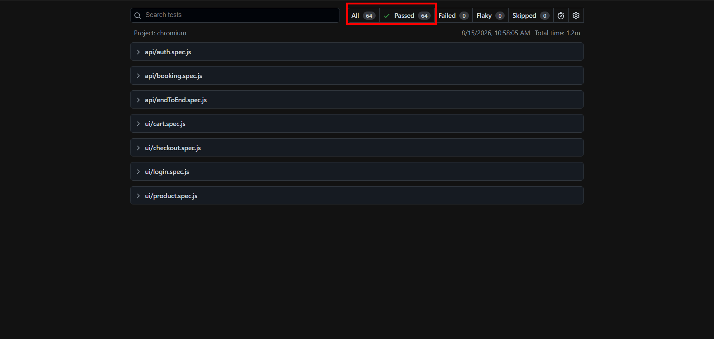
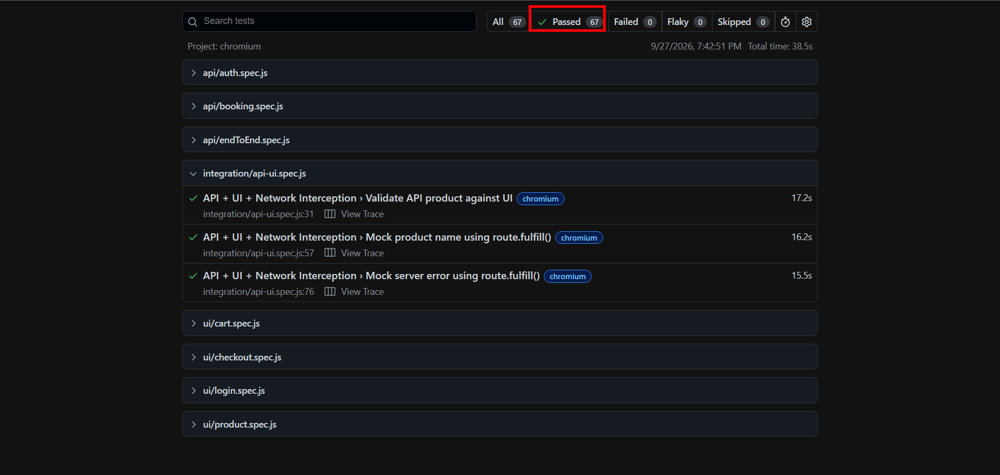

# Playwright E-Commerce Automation Framework

This project started as a Playwright UI automation framework for SauceDemo and gradually evolved into a complete automation framework covering UI testing, API testing, API + UI integration testing, network interception, and CI/CD execution through GitHub Actions.

The goal of this project was not only to automate test cases but also to practice building a maintainable framework using Page Object Model, reusable fixtures, centralized test data, and API abstraction layers.

---

## What This Project Covers

### UI Automation

Automated test coverage for:

- Login functionality
- Product listing and sorting
- Product details validation
- Cart operations
- Checkout flow
- Negative validations

### API Automation

Automated API testing using Restful Booker:

- Authentication
- Create Booking
- Retrieve Booking
- Update Booking
- Partial Update
- Delete Booking
- End-to-End CRUD workflow

### Data Driven Testing (DDT)

Negative booking scenarios are maintained separately in test-data files and executed dynamically, making the tests easier to maintain and extend.

### API + UI Integration Testing

One of the integration scenarios creates data through an API request and then verifies the same data from the UI.

This approach is commonly used in real projects because:

- Test setup becomes faster
- UI dependency is reduced
- End-to-end validation becomes stronger

### Network Interception & Mocking

Playwright route interception is used to modify API responses before they reach the browser.

Example use case:

- Intercept product API response
- Replace product name with mocked value
- Verify UI displays mocked data

This helps test frontend behavior without depending on backend changes.

---

## Framework Structure

```text
pages
├── ui
│   ├── LoginPage
│   ├── ProductPage
│   ├── CartPage
│   └── CheckoutPage
│
└── api
    ├── AuthAPI
    └── BookingAPI

fixtures
└── fixtures.js

test-data
└── reusable test data

tests
├── ui
├── api
└── integration
```

---

## Design Approach

### Page Object Model (POM)

UI interactions are separated into dedicated page classes to improve readability and maintainability.

### API Layer

API requests are encapsulated inside API classes instead of being written directly inside test files.

### Shared Fixtures

Custom fixtures provide:

- Page Objects
- API Clients
- Authentication Tokens
- Common Headers

This keeps test files focused on test logic instead of setup code.

---

## CI/CD

The project uses GitHub Actions to run automation suites automatically.

Current pipeline:

- Install dependencies
- Cache Playwright browsers
- Execute UI tests
- Execute API tests
- Upload Playwright reports

---

## Tech Stack

- Playwright
- JavaScript
- Node.js
- REST API Testing
- GitHub Actions
- dotenv

---

## Running The Tests

Install dependencies:

```bash
npm install
```

Run UI tests:

```bash
npx playwright test tests/ui
```

Run API tests:

```bash
npx playwright test tests/api
```

Run Integration tests:

```bash
npx playwright test tests/integration
```

Run all tests:

```bash
npx playwright test
```

---

## What I Learned While Building This

- Playwright UI Automation
- API Testing using Playwright Request Context
- Framework Design
- Page Object Model
- Custom Fixtures
- Data Driven Testing
- API + UI Integration Testing
- Network Interception & Mocking
- GitHub Actions CI/CD
- Test Maintainability Best Practices

---

## Playwright Report




---

## Author

**Vignesh K S**

QA Automation Engineer

Playwright | API Testing | JavaScript | Selenium | CI/CD
